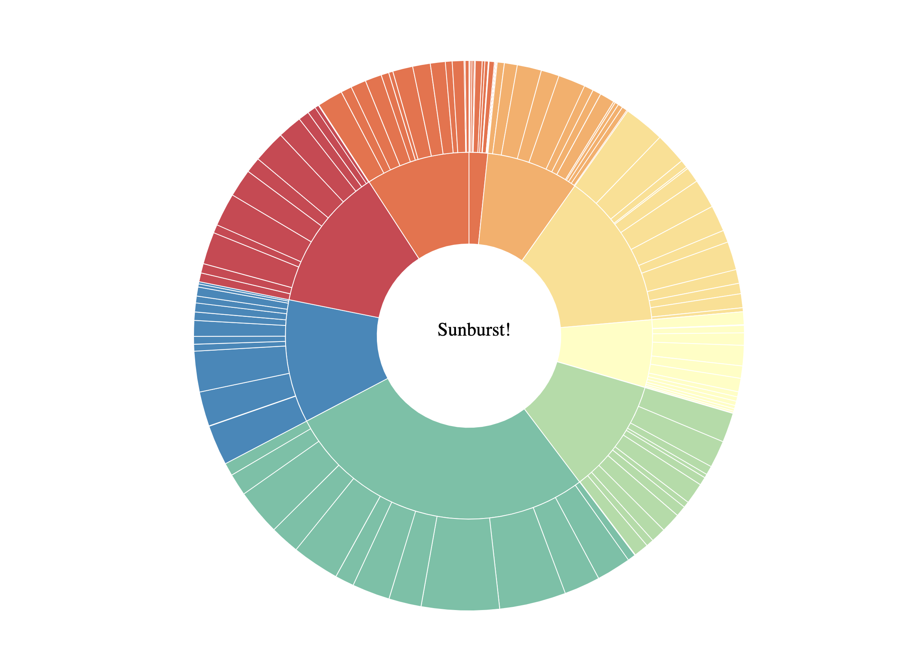
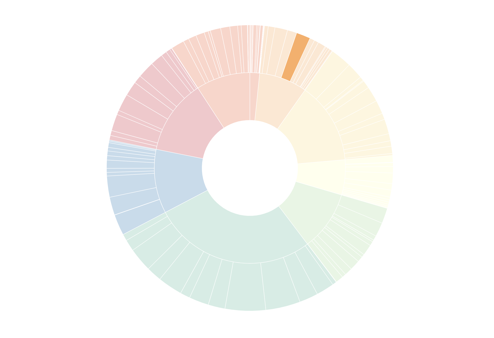
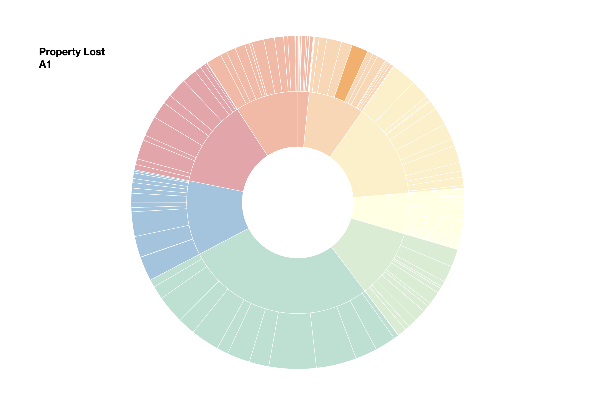
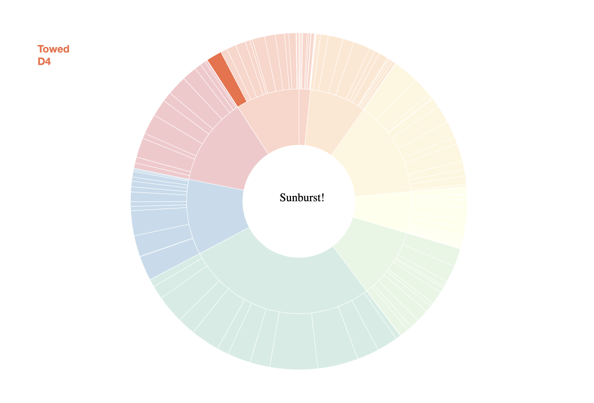

# SUNBURST CHALLENGE

## 1. Add a title

There's nice empty circle in the middle of our tooltip. Perfect for a title! Add a title inside your tooltip. Make sure it is inside the SVG element, and not a `div` on top of it!

*Note: remember when trying to find the "center" of the sunburst, we have already translated the chart!*

## 2. Change the opacity of wedges

On hover, instead of outlining a wedge with a stroke (as we did with the treemap), let's try a different method of highlighting. This time, when a user hovers over a specific wedge, try making all the other wedges "fade" in opacity so they appear lighter. The hovered-upon-wedge should stay at full 100% opacity.

## 3. Add a floating tooltip

People have different names for this, but I like to call them "floating" tooltips. Sunburst wedges are hard to fit labels inside. Instead, create a tooltip that will stay fixed in the same position on the page. When a user hovers, this tooltip should display the name and count of whatever wedge was hovered upon.

*Note: you may notice some fields come back as "undefined". Can you think of why? Try to handle these cases differently than cases where nothing comes back undefined. Using an if/else statement might help. The below task is also related to this one!*

## 4. Color the text dynamically

Use the color scale that we created earlier to match the color of the hovered-upon-wedge with the category name in the tooltip. We want to pass in the `key` to the same color scale we created earlier.

*Remember: not all "leaves" will have parents and children! This means you will need to handle each case differently. Instead of using a ternary operator, consider writing an if/else statement early in your mouseover function and using these variables to color the text.*

